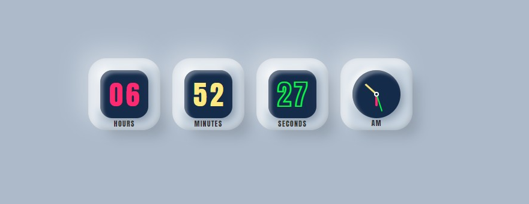

# relogio-digital-&-anologico

## Índice
📋 

- <a href="#sobre-o-projeto">Sobre o Projeto</a>
- <a href="#objetivos">Objetivos</a>
- <a href="#captura-de-tela">Capitura de Tela</a>
- <a href="#linguagens-utilizadas">Linguagens utilizadas</a>
- <a href="#autor">Autor</a>

## Sobre o Projeto

Relógio Digital e Analógico feito com CSS mais avançado.

## Objetivos

- Ganhar mais conhecimento em JavaScript.
- Aprendeer pseudo-elementos em CSS.

## Captura de tela

📸

#### relogio-digital-&-anologico

[⬆ Voltar ao topo](#índice) 

## Demonstração

Demontração :<a href="#">relogio-digital-&-anologico</a>

## Linguagens utilizadas

📝
HTML | CSS | JavaScript

## Autor

🧑‍💻

### Vanderlei Junior

- <a href="https://github.com/VanderleiGeronimoJunior">GitHub</a>
- <a href="https://www.linkedin.com/in/vanderlei-junior-b9956686/">Linkedin</a>
- <a href="https://vanderleijunior.netlify.app/">Site</a>

[⬆ Voltar ao topo](#índice) 
